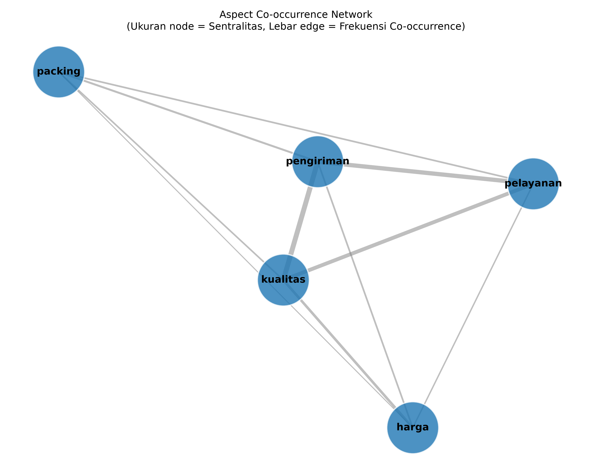
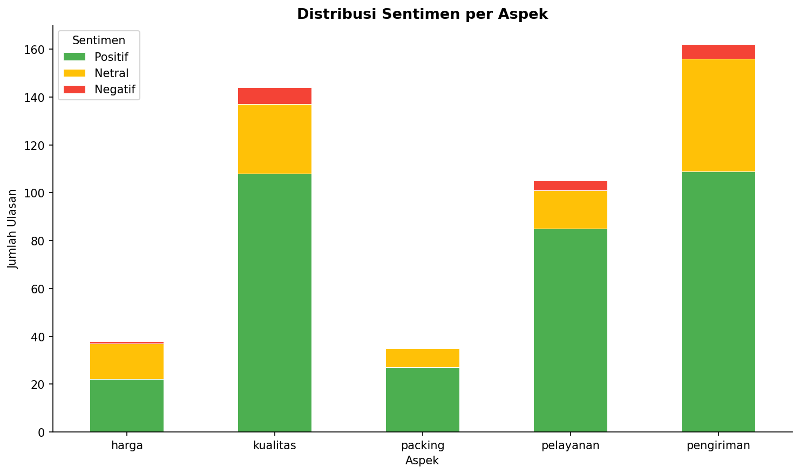
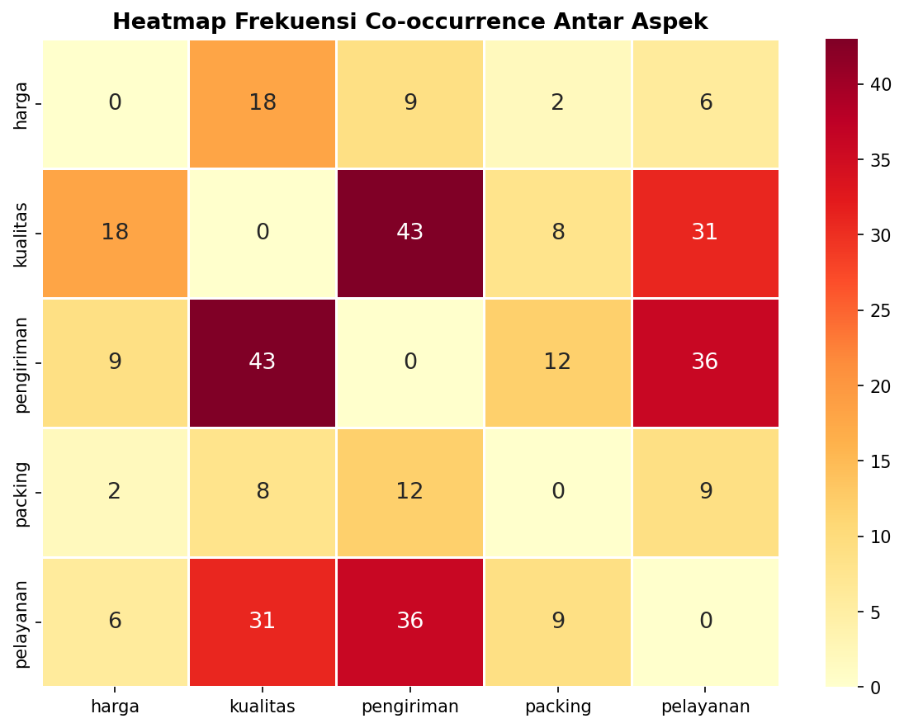
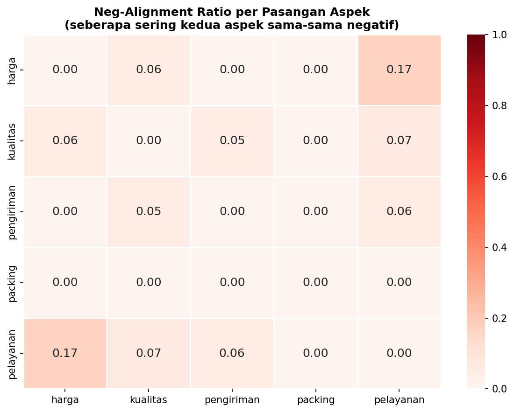

# Aspect Co-occurrence Network: SNA + ABSA pada Ulasan E-Commerce

Project ini menggabungkan **Aspect-Based Sentiment Analysis (ABSA)** dan
**Social Network Analysis (SNA)** untuk membangun **jaringan antar-aspek**
yang diekstrak dari ulasan produk Tokopedia.

**Ide inti:** Dua aspek (misal "harga" dan "kualitas") dianggap "terhubung"
kalau sering disebut bersamaan dalam ulasan yang sama. Bobot koneksi diperkaya
dengan korelasi sentimen - apakah ulasan negatif pada satu aspek cenderung
diikuti negatif pada aspek lain?

## Pertanyaan Penelitian
1. Aspek apa saja yang paling sering muncul bersamaan dalam ulasan?
2. Apakah ada klaster aspek yang secara konsisten "menyeret" sentimen negatif satu sama lain?
3. Aspek mana yang paling sentral/berpengaruh dalam jaringan (centrality)?
4. Apakah pola jaringan aspek berbeda antar kategori produk?

## Dataset
- **Utama:** [Tokopedia Product Reviews](https://www.kaggle.com/datasets/farhan999/tokopedia-product-reviews)
  (~40.607 ulasan produk)

Taruh file CSV di `data/raw/` atau langsung di root project.

## Model ABSA
[`damasukma/indobert-absa`](https://huggingface.co/damasukma/indobert-absa)
(fine-tuned dari `indobenchmark/indobert-base-p1`)

## Visualisasi Analisis (Preview)
Berikut adalah beberapa hasil *plot* yang digenerate oleh pipeline ini:





## Cara Menjalankan

### Opsi 1: Pipeline Otomatis
```bash
python -m venv venv
venv\Scripts\activate       
pip install -r requirements.txt

# Jalankan seluruh pipeline sekaligus:
python run_pipeline.py

# Dengan opsi:
python run_pipeline.py --sample 1000     # ubah jumlah sampel ABSA
python run_pipeline.py --skip-absa       # skip inference, pakai file yg sudah ada
```

### Opsi 2: Per Script
```bash
python src/preprocessing.py    # cleaning & normalisasi
python src/absa_model.py       # ekstraksi aspek + sentimen
python src/graph_builder.py    # bangun graph & export GEXF
python src/visualize.py        
```

### Opsi 3: Jupyter Notebooks
```
notebooks/01_eda.ipynb              → EDA dataset
notebooks/02_absa_extraction.ipynb  → ABSA & evaluasi kualitatif
notebooks/03_graph_building.ipynb   → SNA & centrality analysis
notebooks/04_analysis_viz.ipynb     → Visualisasi akhir & insight
```

## Struktur Repo
```
sna-absa-ecommerce/
├── data/
│   ├── raw/                          # dataset asli (tidak di-commit)
│   └── processed/
│       ├── reviews_clean.csv         # hasil preprocessing
│       └── absa_results.json         # hasil ekstraksi ABSA
├── notebooks/
│   ├── 01_eda.ipynb                  # Exploratory Data Analysis
│   ├── 02_absa_extraction.ipynb      # ABSA & evaluasi
│   ├── 03_graph_building.ipynb       # Bangun graph & SNA
│   └── 04_analysis_viz.ipynb         # Visualisasi & insight akhir
├── src/
│   ├── preprocessing.py              # cleaning & normalisasi teks
│   ├── absa_model.py                 # wrapper IndoBERT ABSA
│   ├── graph_builder.py              # bangun & analisis graph
│   ├── visualize.py                  # generate semua figure
│   └── utils.py                      # helper functions
├── results/
│   ├── figures/                      # semua plot output
│   │   ├── aspect_network.png
│   │   ├── aspect_network.html       # interaktif (drag, zoom, hover)
│   │   ├── sentiment_distribution.png
│   │   ├── aspect_frequency.png
│   │   ├── aspect_sentiment_breakdown.png
│   │   ├── cooccurrence_heatmap.png
│   │   ├── neg_alignment_heatmap.png
│   │   └── confidence_distribution.png
│   ├── graph_exports/
│   │   └── aspect_network.gexf       # untuk dibuka di Gephi
│   ├── centrality_metrics.csv        # tabel degree/betweenness/eigenvector
│   └── edge_attributes.csv           # co-occurrence & neg_ratio per pasangan
├── docs/
│   └── report.md                     # laporan temuan
├── run_pipeline.py                   # one-shot pipeline runner
└── requirements.txt
```

## Roadmap
- [x] EDA dataset (distribusi rating, kategori produk, panjang teks)
- [x] Preprocessing teks (normalisasi bahasa gaul/typo Indonesia)
- [x] Ekstraksi aspek + sentimen per review (ABSA)
- [x] Evaluasi kualitatif hasil ABSA (sampling manual)
- [x] Bangun aspect co-occurrence graph
- [x] Community detection (Louvain) + centrality analysis
- [x] Visualisasi graph (pyvis interaktif + matplotlib statik)
- [x] Neg-alignment heatmap
- [x] Export CSV centrality & edge attributes
- [ ] Studi banding antar kategori produk (opsional)
- [x] Tulis insight di `docs/report.md`

## Lisensi
MIT
