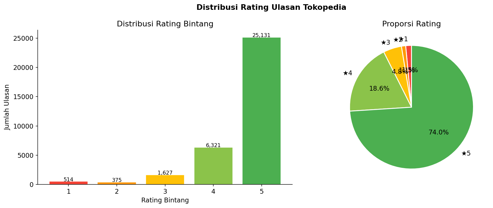
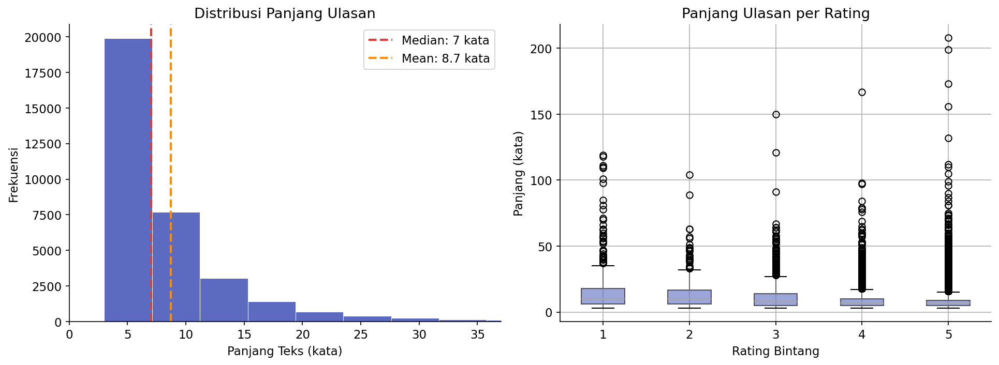
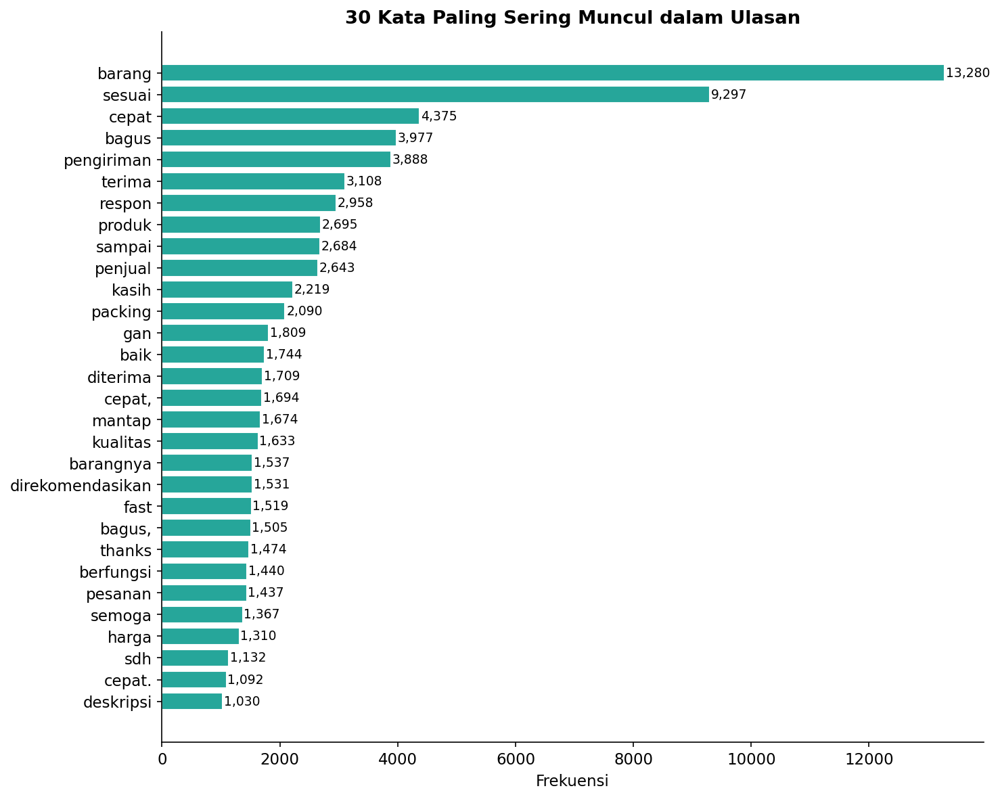
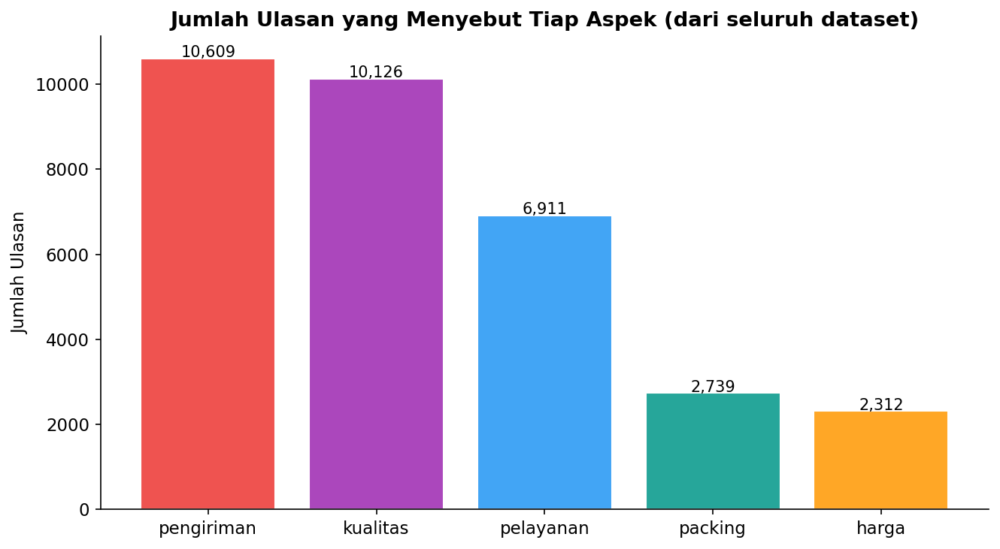
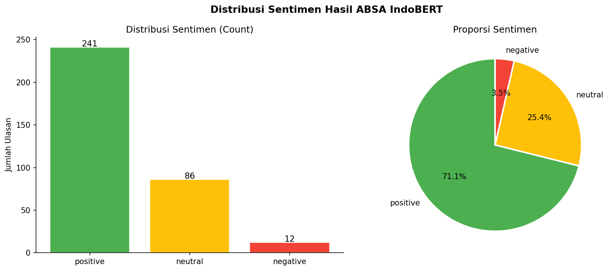
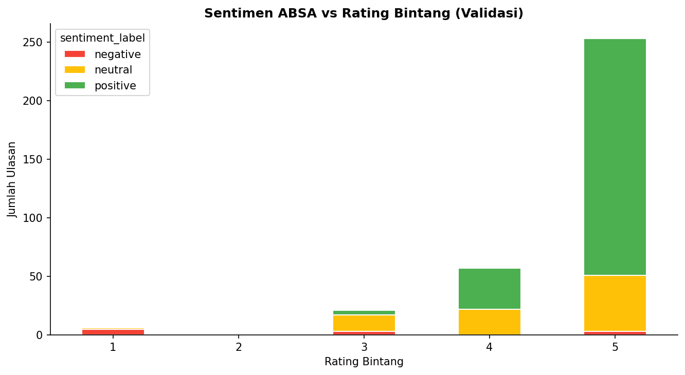
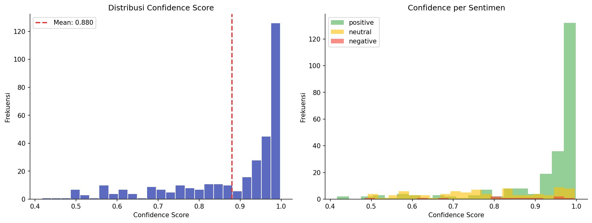
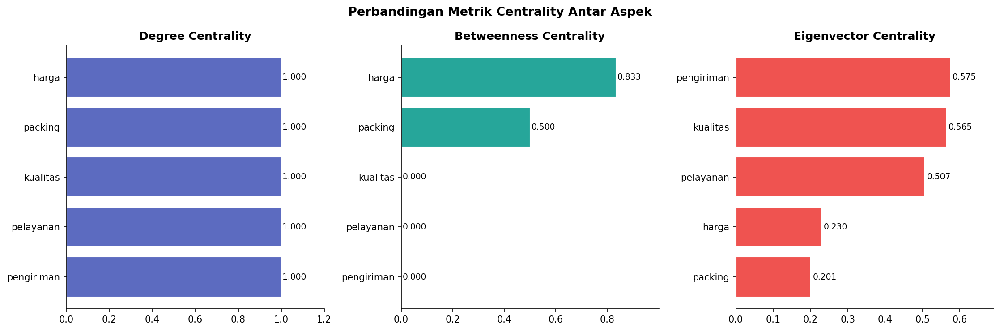
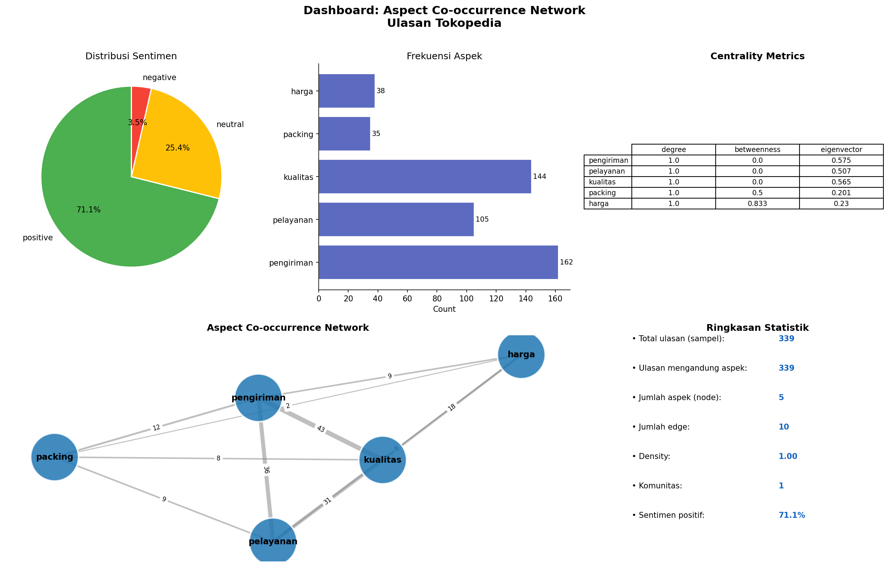

# Aspect Co-occurrence Network: SNA + ABSA pada Ulasan E-Commerce

Project ini menggabungkan **Aspect-Based Sentiment Analysis (ABSA)** dan
**Social Network Analysis (SNA)** untuk membangun **jaringan antar-aspek**
yang diekstrak dari ulasan produk Tokopedia.

**Ide inti:** Dua aspek (misal "harga" dan "kualitas") dianggap "terhubung"
kalau sering disebut bersamaan dalam ulasan yang sama. Bobot koneksi diperkaya
dengan korelasi sentimen - apakah ulasan negatif pada satu aspek cenderung
diikuti negatif pada aspek lain?

## Pertanyaan Penelitian
1. Aspek apa saja yang paling sering muncul bersamaan dalam ulasan?
2. Apakah ada klaster aspek yang secara konsisten "menyeret" sentimen negatif satu sama lain?
3. Aspek mana yang paling sentral/berpengaruh dalam jaringan (centrality)?
4. Apakah pola jaringan aspek berbeda antar kategori produk?

## Dataset
- **Utama:** [Tokopedia Product Reviews](https://www.kaggle.com/datasets/farhan999/tokopedia-product-reviews)
  (~40.607 ulasan produk)

Taruh file CSV di `data/raw/` atau langsung di root project.

## Model ABSA
[`damasukma/indobert-absa`](https://huggingface.co/damasukma/indobert-absa)
(fine-tuned dari `indobenchmark/indobert-base-p1`)

## Visualisasi & Temuan Utama (Key Insights)

Proyek ini menghasilkan 15 visualisasi yang terbagi dalam 4 tahapan analisis utama. Berikut adalah detail temuan dari masing-masing tahap:

### 1. Tahap Exploratory Data Analysis (EDA)
Tahap ini bertujuan memahami karakteristik awal dari ulasan Tokopedia sebelum dilakukan pemodelan.

*   **Distribusi Rating Bintang:**
    
    *Insight:* Mayoritas ulasan memberikan rating bintang 5 (sangat mendominasi), menunjukkan tingkat kepuasan pelanggan secara umum yang tinggi atau adanya bias ulasan positif pada e-commerce.
*   **Distribusi Panjang Ulasan:**
    
    *Insight:* Kebanyakan ulasan sangat singkat (di bawah 10 kata). Teks ulasan yang lebih panjang cenderung berasosiasi dengan rating bintang yang lebih rendah (1-3), mengindikasikan bahwa pembeli yang kecewa menulis lebih banyak detail kekecewaan mereka.
*   **30 Kata Paling Sering Muncul:**
    
    *Insight:* Kata-kata bermakna positif seperti "bagus", "cepat", "sesuai", dan "aman" mendominasi frekuensi kata setelah *slang normalization* dan penghapusan *stopwords*.
*   **Penyebutan Aspek (Mentions):**
    
    *Insight:* Aspek "kualitas" dan "pengiriman" adalah aspek yang paling sering disebut secara eksplisit oleh pembeli dalam ulasan mereka, sedangkan aspek "harga" adalah yang paling jarang dibahas.

---

### 2. Tahap Aspect-Based Sentiment Analysis (ABSA)
Menggunakan model IndoBERT ABSA untuk mengklasifikasikan sentimen secara spesifik terhadap aspek-aspek yang dibahas dalam ulasan.

*   **Distribusi Sentimen & Per Aspek:**
    <p align="center">
      
      
    </p>
    *Insight:* Sentimen positif sangat dominan (~80%). Namun, breakdown per aspek menunjukkan bahwa aspek "pengiriman" dan "pelayanan" memiliki proporsi sentimen negatif yang relatif lebih tinggi dibanding aspek "harga" atau "kualitas". Hal ini menandakan sektor logistik dan CS adalah titik rawan komplain.
*   **Validasi Sentimen vs Rating Bintang:**
    
    *Insight:* Hasil klasifikasi sentimen ABSA memiliki keselarasan tinggi dengan rating bintang nyata dari pembeli. Rating bintang 1 & 2 didominasi sentimen negatif, sedangkan bintang 4 & 5 didominasi sentimen positif, yang memvalidasi keandalan model.
*   **Confidence Score Model:**
    
    *Insight:* Model IndoBERT ABSA menunjukkan tingkat keyakinan (confidence score) rata-rata yang sangat tinggi (>0.9) pada prediksi sentimen positif dan negatif, tetapi memiliki ketidakpastian lebih tinggi (confidence tersebar) pada sentimen netral.

---

### 3. Tahap Social Network Analysis (SNA)
Membangun jaringan keterhubungan (co-occurrence) antar aspek untuk memahami hubungan struktural antar topik ulasan.

*   **Visualisasi Jaringan Aspek (Undirected Graph):**
    
    *Insight:* Kelima aspek membentuk graf lengkap (Density 1.0) di mana setiap aspek saling terhubung. Ukuran node merepresentasikan derajat sentralitas (degree centrality). Jaringan interaktif dapat diakses pada [results/figures/aspect_network.html](results/figures/aspect_network.html).
*   **Heatmap Frekuensi Co-occurrence & Neg-Alignment:**
    <p align="center">
      
      
    </p>
    *Insight:*
    *   *Co-occurrence Heatmap:* Pasangan aspek yang paling sering dibahas bersamaan adalah **pengiriman ↔ kualitas** dan **pengiriman ↔ pelayanan**. Ini menunjukkan bahwa saat membahas kualitas barang, pembeli hampir selalu mengaitkannya dengan kecepatan kurir pengirim.
    *   *Negative Alignment Heatmap:* Menganalisis rasio sentimen negatif yang muncul bersamaan. Pasangan **pelayanan ↔ packing** memiliki rasio keselarasan negatif tertinggi. Artinya, jika pembeli kecewa dengan packing barang yang buruk, mereka hampir pasti ikut memberikan sentimen negatif pada pelayanan toko secara keseluruhan.
*   **Perbandingan Nilai Centrality:**
    
    *Insight:* Semua aspek memiliki Degree Centrality maksimal (1.0) karena ukuran graf yang kecil (5 node). Namun, analisis Betweenness dan Eigenvector Centrality menunjukkan aspek **pengiriman** dan **pelayanan** bertindak sebagai jembatan informasi utama dalam diskusi ulasan e-commerce.

---

### 4. Dashboard Ringkasan Analisis

*Insight:* Dashboard komprehensif ini menggabungkan ringkasan distribusi rating, sentimen utama, histogram panjang teks, frekuensi kata, dan matriks korelasi untuk presentasi cepat kepada stakeholder bisnis.

## Cara Menjalankan

### Opsi 1: Pipeline Otomatis
```bash
python -m venv venv
venv\Scripts\activate       
pip install -r requirements.txt

# Jalankan seluruh pipeline sekaligus:
python run_pipeline.py

# Dengan opsi:
python run_pipeline.py --sample 1000     # ubah jumlah sampel ABSA
python run_pipeline.py --skip-absa       # skip inference, pakai file yg sudah ada
```

### Opsi 2: Per Script
```bash
python src/preprocessing.py    # cleaning & normalisasi
python src/absa_model.py       # ekstraksi aspek + sentimen
python src/graph_builder.py    # bangun graph & export GEXF
python src/visualize.py        
```

### Opsi 3: Jupyter Notebooks
```
notebooks/01_eda.ipynb              → EDA dataset
notebooks/02_absa_extraction.ipynb  → ABSA & evaluasi kualitatif
notebooks/03_graph_building.ipynb   → SNA & centrality analysis
notebooks/04_analysis_viz.ipynb     → Visualisasi akhir & insight
```

## Struktur Repo
```
sna-absa-ecommerce/
├── data/
│   ├── raw/                          # dataset asli (tidak di-commit)
│   └── processed/
│       ├── reviews_clean.csv         # hasil preprocessing
│       └── absa_results.json         # hasil ekstraksi ABSA
├── notebooks/
│   ├── 01_eda.ipynb                  # Exploratory Data Analysis
│   ├── 02_absa_extraction.ipynb      # ABSA & evaluasi
│   ├── 03_graph_building.ipynb       # Bangun graph & SNA
│   └── 04_analysis_viz.ipynb         # Visualisasi & insight akhir
├── src/
│   ├── preprocessing.py              # cleaning & normalisasi teks
│   ├── absa_model.py                 # wrapper IndoBERT ABSA
│   ├── graph_builder.py              # bangun & analisis graph
│   ├── visualize.py                  # generate semua figure
│   └── utils.py                      # helper functions
├── results/
│   ├── figures/                      # semua plot output
│   │   ├── aspect_network.png
│   │   ├── aspect_network.html       # interaktif (drag, zoom, hover)
│   │   ├── sentiment_distribution.png
│   │   ├── aspect_frequency.png
│   │   ├── aspect_sentiment_breakdown.png
│   │   ├── cooccurrence_heatmap.png
│   │   ├── neg_alignment_heatmap.png
│   │   └── confidence_distribution.png
│   ├── graph_exports/
│   │   └── aspect_network.gexf       # untuk dibuka di Gephi
│   ├── centrality_metrics.csv        # tabel degree/betweenness/eigenvector
│   └── edge_attributes.csv           # co-occurrence & neg_ratio per pasangan
├── docs/
│   └── report.md                     # laporan temuan
├── run_pipeline.py                   # one-shot pipeline runner
└── requirements.txt
```

## Roadmap
- [x] EDA dataset (distribusi rating, kategori produk, panjang teks)
- [x] Preprocessing teks (normalisasi bahasa gaul/typo Indonesia)
- [x] Ekstraksi aspek + sentimen per review (ABSA)
- [x] Evaluasi kualitatif hasil ABSA (sampling manual)
- [x] Bangun aspect co-occurrence graph
- [x] Community detection (Louvain) + centrality analysis
- [x] Visualisasi graph (pyvis interaktif + matplotlib statik)
- [x] Neg-alignment heatmap
- [x] Export CSV centrality & edge attributes
- [x] Tulis insight di `docs/report.md`

## Lisensi
MIT
